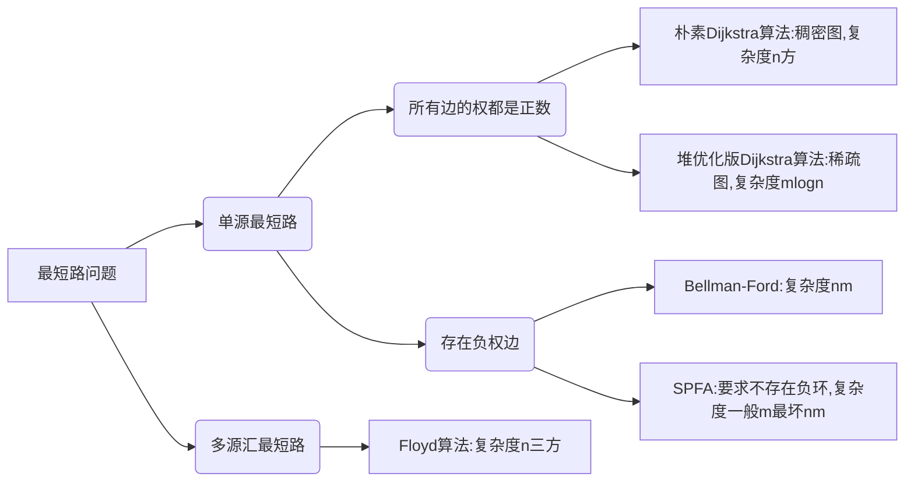

[TOC]

# 基础算法

## 排序

### 快速排序

快速排序本质上就是分治！

1. **确定分界点x**：取左边界 q[l]，或者取中间值 q[(l+r)/2]，或者取右边界 q[r]，也可以随机；
2. **调整区间**(较难部分)：让小于等于 x 的数在一个区间，大于 x 的在另一个区间
3. **递归处理左右两端**

**平均时间复杂度**： O(nlogn)，每层期望是 n/2 ，递归深度 logn

**思路1**（暴力解法，需要额外空间放a[] b[]）

**思路2：**（较优美的解法）
使用双指针，从数组两端向中间靠拢。指针 i 从左端找大于等于 x 的数，指针 j 从右端找小于等于 x 的数，然后swap二者，直至 i 和 j 相遇。

```java
private static int[] quickSort(int[] arr, int left, int right) {
    // 递归终止条件，如果左边界下标大于等于右边界下标则认为递归结束
    if (left >= right) {
        return arr;
    }
    // 设定一个分界值，这里是（left + right）/ 2，向下取整
    // 基准值一定要设定为一个具体的数，而不是一个位置，否则交换时基准可能改变
    int p = arr[left + right >> 1];
    // 左右提前预留一个位置
    int i = left - 1;
    int j = right + 1;
    while (i < j) {
        // 等效于do while
        // 当数值小于分界值时持续遍历，直到找到第一个大于等于分界值的索引
        while (arr[++i] < p);
        while (arr[--j] > p);
        // 交换左右两侧不符合预期的数值
        if (i < j) {
            swap(arr[i], arr[j])
        }
    }
    // 由于分界值取的是left + right >> 1，因此递归取的是left，j j + 1，right
    quickSort(arr, left, j);
    quickSort(arr, j + 1, right);
    return arr;
}
```

### 归并排序

归并排序本质上就是分治！

**基本思想**

1. **确定分界点** mid = ( l + r ) / 2，划分 left、right
2. **递归排序** left，right。
3. **归并**——合二为一。（较难步骤）

**时间复杂度**： O(nlogn)

**快排是不稳定的，归并是稳定的。**

```java
private static int[] mergeSort(int[] arr, int left, int right) {
    // 递归终止条件，如果左边界大于等于右边界则认为递归结束
    if (left >= right) {
        return arr;
    }
    // 1.设定一个分界值，这里是（left + right）/ 2
    int mid = left + right >> 1;
    // 2.切割，递归排序
    arr = mergeSort(arr, left, mid);
    arr = mergeSort(arr, mid + 1, right);
    // 临时存放的数组
    int[] temp = new int[right - left + 1];
    // 两个指针
    int i = left;
    int j = mid + 1;
    // 用来归并的索引
    int k = 0;
    // 3.归并
    while (i <= mid && j <= right) {
        // 如果是逆序则调整if条件
        if (arr[i] <= arr[j]) {
            temp[k++] = arr[i++];
        } else {
            temp[k++] = arr[j++];
        }
    }
    while (i <= mid) {
        temp[k++] = arr[i++];
    }
    while (j <= right) {
        temp[k++] = arr[j++];
    }
    // 根据归并后的数组重新赋值排序后的数组
    for (i = left, j = 0; i <= right; i++, j++) {
        arr[i] = temp[j];
    }
    return arr;
}
```

## 二分查找——找边界

有单调性一定可以二分，但是可以二分的题目不一定非要有单调性。
核心：找到一个边界将区间划分为两部分，使得一部分满足 ckeck，另一部分不满足。

### 整数二分

两种模板，分别是 LBS，和 RBS

```java
// 检查x是否满足某种性质  
private static boolean check(int x) {  
   /* ... */  
}  

// 区间[left, right]被划分成[left, mid]和[mid + 1, right]时使用： 
// 称之为左二分查询，查找左侧第一个满足条件的数
private static int leftBinarySearch(int[] arr, int left, int right) {  
   while (left < right) {  
      int mid = left + right >> 1;  
      if (check(arr[mid])) {  
         right = mid;    // check()判断mid满足右侧性质
      } else {  
         left = mid + 1;  
      }  
   }  
   return left;  
}  

// 区间[left, right]被划分成[left, mid - 1]和[mid, right]时使用：  
// 称之为右二分查询，查找右侧最后一个满足条件的数
private static int rightBinarySearch(int[] arr, int left, int right) {  
   while (left < right) {  
      int mid = left + right + 1 >> 1; // 向下取整，所以要加一，避免死循环 
      if (check(arr[mid])) {  
         left = mid;    // check()判断mid满足左侧性质 
      } else {  
         right = mid - 1;  // 有加必有减
      }  
   }  
   return left;  
}
```

### 浮点数二分

double 可以直接除而不会取整，所以不用在意边界问题，较为简单。
判断条件一般为 r - l >= 1e-6.
次数一般取要求的保留小数点位数+2，例如保留5位小数，就是1e-7.

也可以不用 while，直接 for 循环100次，相当于区间除以 2 的100次方，得到的位数足够。

```java
// 检查x是否满足某种性质  
private static boolean check(double x) {  
   /* ... */  
}  

// eps 表示精度，取决于题目对精度的要求，默认负六次方
private static double EPS = 1e-6;

private static double floatBinarySearch(double left, double right) {  
   while (right - left > EPS) {  
      double mid = (left + right) / 2;  
      if (check(mid)) {  
         right = mid;  
      } else {  
         left = mid;  
      }  
   }  
   return left;  
}
```

## 高精度（C++ 需要，Java 和 Python 不关注）

对于一个大整数，通常用数组来存，通常**从低位开始存**较好。
原因是：因为整数相加要进位，当最高位要进位的时候，在数组的末尾使用 push_back() 加一位即可，较方便。反之，在头部加一位要将整个数组后移，较麻烦。

- 高精度加法
- 高精度减法
- 高精度乘低精度
- 高精度除以低精度


## 前缀和与差分

### 一维前缀和

S 下标从 1 开始，定义 S[0] = 0，是为了同一计算

```java
S[i] = a[1] + a[2] + ... a[i]
a[l] + ... + a[r] = S[r] - S[l - 1]
```

### 二维前缀和

同样从 1 开始

```java
S[i, j] = 第i行j列格子左上部分所有元素的和
以(x1, y1)为左上角，(x2, y2)为右下角的子矩阵的和为：
S[x2, y2] - S[x1 - 1, y2] - S[x2, y1 - 1] + S[x1 - 1, y1 - 1]
```

### 一维差分

差分是前缀和的逆运算，即根据给出的前缀和求原数组的值，这里根据 A[ ] 数组，构造 B[ ] 数组，使得 A 是 B 的前缀和。

差分有什么作用？
如果需要将数组 A[ ] 的 [ l , r ] 区间内所有数都 + c，操作 A 数组时，需要遍历一遍，时间复杂度为 O(n)。而操作 B 数组时，只需要将 $b_l + c$ ，就可以使的从 a[ l ] 到 a[ n ]的所有数都加 c，再使用 $b_{r+1} - c$，消除对 a[ r ]之后数的影响，就可以将时间复杂度降至 O(1)。

```java
给区间 A[l, r]中的每个数加上 c：B[l] += c, B[r + 1] -= c
差分构造：B[i] = A[i] - A[i - 1];  
更精简的，可以想象A初始为0，然后依次插入A[i,j]的元素，就可以统一理解了
```

### 二维差分

```java
给以(x1, y1)为左上角，(x2, y2)为右下角的子矩阵中的所有元素加上 c：
S[x1, y1] += c, S[x2 + 1, y1] -= c, S[x1, y2 + 1] -= c, S[x2 + 1, y2 + 1] += c
```

## 双指针算法

对于以往需要双重 for 循环暴力解的题目进行优化；在快排和归并排序中都用到了双指针的思想。

所以一般做题都是先用暴力解法想思路，再用双指针优化时间复杂度。

```java
for (int i = 0, j = 0; i < n; i ++ ) {
    while (j < i && check(i, j)) {
        j ++ ;
    }
    // 具体问题的逻辑
}
常见问题分类：
    (1) 对于一个序列，用两个指针维护一段区间
    (2) 对于两个序列，维护某种次序，比如归并排序中合并两个有序序列的操作
```

## 位运算

1.求 n 的二进制第 k 位数字: n >> k & 1
2.返回 n 的二进制最后一位 1：lowbit(n) = n & -n = n & (~n + 1)
因为反码 -n 是 n 的负数，即为 n 的补码加 1 ：-n = ~n + 1

## 离散化——处理稀疏问题

这里指整数的离散化，且是保序的离散化：将数组 a[ ] 中的数映射到 0 1 2 3 4 … 这样连续的自然数

1. a[ ] 中可能存在重复元素：去重
2. 排序
3. 如何算出某一个数 x 离散化后的映射值 ：二分

## 区间合并

1. 按区间左端点排序
2. 把有交集的区间合并——维护一个当前的区间，下个区间与其关系是 ...

```java
// 将所有存在交集的区间合并，两个区间只有端点相同时，也可以合并
// 如果只用输出合并后区间的个数，其实可以大大简化代码
private static int[][] merge(int[][] a) {  
   if (a == null || a.length == 0 || a[0].length == 0) {  
      return new int[0][2];  
   }  
   Arrays.sort(a, Comparator.comparingInt(item -> item[0]));  
   List<int[]> res = new ArrayList<>();  
   for (int[] arr : a) {  
      int left = arr[0];  
      int right = arr[1];  
      int cur = res.size() - 1;	// res中待比较的当前区间的下标
      if (res.size() == 0 || res.get(cur)[1] < left) {  
         res.add(new int[]{left, right});  
      } else {  
         int newRight = Math.max(res.get(cur)[1], right);  
         res.set(cur, new int[]{res.get(cur)[0], newRight});  
      }  
   }  
   return res.toArray(new int[res.size()][2]);  
}
```

# 数据结构

## 链表与邻接表

### 链表

使用结构体加指针的方式实现链表非常慢，所以笔试题一般不用，主要面试用，这里使用数组模拟链表的方式。

#### 数组模拟单链表

单链表在算法题、笔试里用的最多的是邻接表，邻接表最常见的应用就是：存储图和树。

```java
// head存储头指针，e[]存储节点的值，ne[]存储节点的next指针，idx表示当前用到了哪个节点
int head, e[N], ne[N], idx;

// 初始化
void init() {
    // 下标0不存东西
    head = 0;
    idx = 1;
}

// 在链表头插入一个数x
public static void addHead(int x) {
    // 先记录 idx 的值
    // 然后让 idx 指向头指针指向的结点
    // 修改s指针的指向为 idx
    // idx 加 1
    e[idx] = x;
    ne[idx] = head;
    head = idx ++;
}
// 将x插入到下标k节点后面s
public static void add(int k, int x) {
    e[idx] = x;
    ne[idx] = ne[k];
    ne[k] = idx ++;
}

//将下标k后面的点删掉
public static void remove(int k){
    // 第 k 个结点指向 next 的 next
    else ne[k] = ne[ne[k]];
}
```

#### 数组模拟双链表

双链表主要是用来优化某些问题

```java
// e[]表示节点的值，l[]表示节点的左指针，r[]表示节点的右指针，idx表示当前用到了哪个节点
// 不设置 head 和 tail ，设置 0 和 1 为 head 和 tail
int e[N], l[N], r[N], idx;

// 初始化
void init() {
    //head是左端点，tail是右端点，最后都会插在两者之间
    int head = 0, tail = N - 1;
    r[head] = tail, l[tail] = head;
    idx = 1;
}

// 在节点k的右边插入一个数x
void insert(int k, int x) {
    e[idx] = x;
    l[idx] = k, r[idx] = r[k];
    l[r[k]] = idx, r[k] = idx ++ ;
}

// 在k的右边插入x
insert(l[k], x)

// 删除节点k
void remove(int k) {
    l[r[k]] = l[k];
    r[l[k]] = r[k];
}

```

## 栈与队列

### 栈

#### 普通栈

```java
// tt表示栈顶
int stk[N], tt = 0;

// 向栈顶插入一个数
stk[ ++ tt] = x;

// 从栈顶弹出一个数
tt -- ;

// 栈顶的值
stk[tt];

// 判断栈是否为空
if (tt > 0)
```

#### 单调栈

**常用题型**：在序列中每一个数的左/右边离他最近的比它小/大的数字在什么地方。

```java
int tt = 0;
for (int i = 1; i <= n; i ++ ) {
    while (tt && check(stk[tt], i)) tt -- ;
    stk[ ++ tt] = i;
}
```

### 队列

#### 普通队列

```java
// hh 表示队头，tt表示队尾
int q[N], hh = 0, tt = -1;

// 向队尾插入一个数
q[ ++ tt] = x;

// 从队头弹出一个数
hh ++ ;

// 队头的值
q[hh];

// 判断队列是否为空
if (hh > tt)
```

#### 单调队列

```java
// 常见模型：找出滑动窗口中的最大值/最小值
int hh = 0, tt = -1;
// 数组 q 保存滑动窗口处理后的严格单调队列元素的下标
int[] q;
for (int i = 0; i < n; i ++ ) {
    // 判断队头是否需要滑出窗口
    // 队列不空且满足弹出条件
    if (hh <= tt && check_out(q[hh])) hh ++ ; 
    // 判断队尾元素是否需要弹出
    while (hh <= tt && check(q[tt], i)) tt -- ;
    q[ ++ tt] = i;
}
```

## KMP

```java
// s[n]是长文本，p[m]是模式串
// 求模式串的Next数组，从1开始：
for (int i = 2, j = 0; i <= m; i ++ ) {
    while (j && p[i] != p[j + 1]) j = ne[j];
    if (p[i] == p[j + 1]) j ++ ;
    ne[i] = j;
}

// 匹配
for (int i = 1, j = 0; i <= n; i ++ ) {
    while (j && s[i] != p[j + 1]) j = ne[j];
    if (s[i] == p[j + 1]) j ++ ;
    if (j == m) {
        // 再次匹配
        j = ne[j];
        // 匹配成功后的逻辑
    }
}
```

## Tire 字典树

Trie树：高效存储和查找字符串集合的数据结构

```java
int son[N][26], cnt[N], idx;
// 0号点既是根节点，又是空节点
// son[][]存储树中每个节点的子节点，相当于链表中的ne[]
// cnt[]存储以每个节点结尾的单词数量
// idx 可以理解为不同的结点

private static void insert(String s) {  
   // 指针，从根节点到尾节点，跟随o的遍历而变化
   int p = 0;  
   for (int i = 0; i < s.length(); i++) {  
      // u是字符的int值  
      int u = s.charAt(i) - 'a';  
      // 如果匹配不到，则创建该节点
      if (son[p][u] == 0) son[p][u] = ++idx;  
      // 更新结点
      p = son[p][u];  
   }  
   cnt[p]++;  
}  

private static int query(String s) {  
   int p = 0;  
   for (int i = 0; i < s.length(); i++) {  
      int u = s.charAt(i) - 'a';  
      if (son[p][u] == 0) return 0;
      p = son[p][u];  
   }
   return cnt[p];  
}
```

## 并查集

并查集可以在近乎 O(1) 的时间内完成以下两个操作

1. 将两个集合合并
2. 查询两个元素是否在一个集合当中

**基本原理**：每个集合用一棵树来表示，树根的编号就是整个集合的编号，每个节点存储它的父节点，p[x] 表示 x 的父节点。

- 问题一：如何判断树根：if(p[x] == x)，除了根节点之外，p[x] 都不等于 x；
- 问题二：如何求 x 的集合编号（树根）：while(p[x] != x) x = p[x]；
- 问题三：如何合并两个集合：p[x] 是 x 的集合编号，p[y] 是 y 的集合编号，p[x] = y。
- 优化：
	- 路径压缩：一个节点找到根节点，就把路径上经过的所有节点都指向根节点；
	- 按质合并：一般很少用。

```java
(1)朴素并查集：

    int p[N]; //存储每个点的祖宗节点
    // 返回x的祖宗节点
    int find(int x) {
        if (p[x] != x) p[x] = find(p[x]);
        return p[x];
    }
    // 初始化，假定节点编号是1~n
    for (int i = 1; i <= n; i ++ ) p[i] = i;
    // 合并a和b所在的两个集合：
    p[find(a)] = find(b);

(2)维护size的并查集：

    //size[]只有祖宗节点的有意义，表示祖宗节点所在集合中的点的数量
    int p[N], size[N];

    int find(int x) {
        if (p[x] != x) p[x] = find(p[x]);
        return p[x];
    }
    
    for (int i = 1; i <= n; i ++ ) {
        p[i] = i;
        size[i] = 1;
    }
    // 合并a和b所在的两个集合，下面两句一定不能颠倒：
    size[find(b)] += size[find(a)];
    p[find(a)] = find(b);

(3)维护到祖宗节点距离的并查集：
    
    // d[x]存储x到p[x]的距离
    int p[N], d[N];

    // 返回x的祖宗节点
    int find(int x){
        if (p[x] != x){
            int u = find(p[x]);
            d[x] += d[p[x]];
            p[x] = u;
        }
        return p[x];
    }

    for (int i = 1; i <= n; i ++ ){
        p[i] = i;
        d[i] = 0;
    }
    // 合并a和b所在的两个集合：
    p[find(a)] = find(b);
    d[find(a)] = distance; // 根据具体问题，初始化find(a)的偏移量
```

## 堆

堆的**存储**（完全二叉树）：
按照小根堆（最小堆）来存储；使用一维数组存储，下标从 1 开始，若父节点为 x ，则左儿子为 2x，右儿子为 2x+1。

**两个基本操作**：
down(x)：将一个节点向下移；实现逻辑：与较小的儿子交换
up(x)：将一个节点向上移；实现逻辑：与父节点比较，若小于父节点则交换

在将一个**数组建堆**的时候，若一个个插入堆，时间复杂度为 O(nlogn)，而使用 for (int i= n /2; i; i-- ) down(i)；可实现 O(n) 建堆，因为最下面一排叶节点不用参与。

```java
// h[N]存储堆中的值, h[1]是堆顶，x的左儿子是2x, 右儿子是2x + 1
// ph[k]存储第 k 个插入的点在堆中的位置
// hp[m]存储堆中下标是 m 的点是第几个插入的
int h[N], ph[N], hp[N], size;

// 交换两个点，及其映射关系，一般的堆不需要维护复杂的映射关系
void heap_swap(int a, int b) {
    swap(ph[hp[a]],ph[hp[b]]);
    swap(hp[a], hp[b]);
    swap(h[a], h[b]);
}
// 进行down操作时必须满足左儿子和右儿子已经是堆
void down(int u) {
    // 三个点中的最小值
    int t = u;
    // 如果左子节点合法，并且左子节点小于当前节点，则需要调整堆
    if (u * 2 <= size && h[u * 2] < h[t]) t = u * 2;
    // 同理
    if (u * 2 + 1 <= size && h[u * 2 + 1] < h[t]) t = u * 2 + 1;
    // 如果需要调整
    if (u != t) {
        heap_swap(u, t);
        // 递归
        down(t);
    }
}

void up(int u) {
    // 父节点合法，并且父节点大于当前节点
    while (u / 2 > 0 && h[u] < h[u / 2]) {
        heap_swap(u, u / 2);
        u >>= 1;
    }
}

// O(n)建堆
for (int i = n / 2; i > 0; i -- ) down(i);
```

实现五个基本使用操作：

1. 插入一个数：`heap[++size] = x; up(size);`
2. 求集合当中的最小值：`heap[1];`
3. 删除最小值：`heap[1] = heap[size]; size--; down(1);`（最后一个元素覆盖堆顶元素）
4. 删除任意一个元素：`heap[k] = heap[size]; size--; down(k); up(k);`（同理）
5. 修改任意一个元素：`heap[k] = x; down(k); up(k);`

除了 2 是 O(1) 的，其他是 O(logn) 的。

## 哈希表

### 一般哈希

将一个很大的值域映射到 0~N 的空间上，一般 N 为 $10^5$ 或 $10^6$。
一般映射是使用取模的方法，且 mod 的数一般取质数，该质数一般离 2 的整次幂尽可能的远，因为这样取的话，冲突的可能性最小。
这里取 x mod 大于 $10^5$ 的质数，第一个为 100003，主要区别在于映射时的冲突如何处理。
一般只有添加和查找两个操作，很少会有删除的操作。

**存储结构**

**拉链法**
开一个一维数组存储所有的值，数组中的每一位存储 e[ ] 和 ne[ ]，因为把每一位看作一个槽，里面放一个链表，理想的情况下每个槽只有一个数，冲突的时候会需要链表。
**添加**和**查找**：h(x)


**开放寻址法**
只开了一个一维数组没有开链表，一般长度为题目数据范围的 2 ~ 3 倍（经验范围，这样发生冲突的可能性较低）。
处理冲突：h(x) = k，若该位置已有数值，则后移一位，直至移至一个空位存储。

**添加**：h(x) = k，有数就后移，没数就存储，若有相同数则无需操作。
**查找**：h(x) = k，当前位有数判断是否为 x ，不是就后移，直至找到或者遇到空位，遇到空位说明不存在 x 

```java
(1) 拉链法
int h[N], e[N], ne[N], idx;

// 向哈希表中插入一个数
void insert(int x) {
    // 由于负数求模也是负数，因此加上N
    int k = (x % N + N) % N;
    // 头插法
    e[idx] = x;
    ne[idx] = h[k];		// h[k]理解为头指针
    h[k] = idx++;
}
// 在哈希表中查询某个数是否存在
bool find(int x) {
    int k = (x % N + N) % N;
    for (int i = h[k]; i != 0; i = ne[i])
        if (e[i] == x) return true;
    return false;
}

(2) 开放寻址法
int h[N];
Arrays.fill(h, Integer.MAX_VALUE);	// 代表此位置没有被用
// 如果x在哈希表中，返回x的下标；如果x不在哈希表中，返回x应该插入的位置
int find(int x) {
    int t = (x % N + N) % N;
    while (h[t] != Integer.MAX_VALUE && h[t] != x) {
        t ++ ;
        // 循环，最后一个坑位看完了看第一个
        if (t == N) t = 0;
    }
    return t;
}
```

### 字符串前缀哈希

简单说就是把一个字符串映射成一个数字
具体点，就是把一个字符串如 ”ABC” 映射成一个 p 进制的数字
$ABC –> p^2*A + p^1*B + p^0*C$ = 哈希值

**求哈希值的方法：**

1. 将字符串看作是一个 P 进制的数
2. 将该 P 进制的数改为 10 进制数
3. 模 Q 来将该数字映射到 0 ~ Q - 1 的区间

**注意：**

1. 一般**不能映射成 0** 。（原因：可能会将不同的字符串映射为相同的值。如，若 A 为 0 ，映射后为 0 ；AA 也为 0 ，映射后同样是 0）
2. 一般取 **P = 131 或 13331** ，**Q = $2^{64}$**，基本不会出现冲突。

```java
// h[k]存储字符串前k个字母的哈希值, p[k]存储 P^k mod Q，java中long有溢出操作，溢出的结果就是取模的结果
long[] h[N], p[N]; 
char[] sc;		// 字符化
// 初始化
p[0] = 1;
for (int i = 1; i <= n; i ++ ) {
    h[i] = h[i - 1] * P + sc[i];
    p[i] = p[i - 1] * P;
}
// 计算子串 sc[l ~ r] 的哈希值
long get(int l, int r) {
    // 因为取模运算对加减乘都是同态的，所以用取模后的结果来计算，再取模得到的结果也一定是正确的
    return h[r] - h[l - 1] * p[r - l + 1];
}
```

# 搜索与图论

## 树与图的存储

存储方式两种：

邻接矩阵（用的较少） 不能保存重边，空间复杂度为 $n^2$，较适合存储稠密图。
邻接表（用的多） 在数组的每个节点上都有一个单链表。每次插入一个链接时，在单链表头部插入（头插法）

```java
// 对于每个点k，开一个单链表，存储k所有邻接点；h[k]存储这个单链表的头指针（类似拉链表）
int h[N], e[N], ne[N], idx;

// 添加一条边a->b，没有顺序
void add(int a, int b) {
    e[idx] = b;
    ne[idx] = h[a];
    h[a] = idx++;
}
```

## 树与图的搜索

DFS 优先深度，到不能再前进的时候（叶子节点）再回溯；BFS 一层层搜索，搜索完每一代节点后，再搜索下一代节点。

|          |       DFS       |   BFS    |
| :------: | :-------------: | :------: |
| 数据结构 |      stack      |  queue   |
|   空间   | O(h)（h为深度） | $O(2^h)$ |

DFS 在空间使用上有优势，但不具有**最短路**性。
BFS 有一个**最短路**的概念，即假设树中每条边的权重均为1， BFS 搜索到某一个点的路径，一定是最短距离。

最小步数、最短距离，最少操作等：BFS
算法思路较奇怪或者空间要求较高：DFS

### DFS

最重要的考虑点在于：**顺序**，决定要以什么样的顺序来遍历所有方案；时间复杂度 O(n+m)
回溯时不要忘了**恢复现场**，即回溯前是什么样，回溯后还应时什么样。

```java
void dfs(int u) {
    state[u] = true;
    if(到达终点状态) return; 
    for (int i = h[u]; i != 0; i = ne[i]) {	// 遍历可扩展的路径
        int j = e[i];	// 扩展节点
        if (!state[j] && check()) {	// 扩展节点是否合法，剪枝
            修改现场;
            dfs(j);
            还原现场;	// 看是否需要
        }
    }
}
```

### BFS

```java
Queue<Integer> q;
state[1] = true;	// 表示1号点已经被遍历过
q.add(1);

while (!q.isEmpty()){
    int t = q.poll();

    for (int i = h[t]; i != 0; i = ne[i]) {	// 队头（当前节点）可扩展路径
        int j = e[i];	// 扩展节点
        if (check() && !state[j]) {		// 是否能走以及是否走过
            state[j] = true;
            q.add(j);
        }
    }
}
```

#### 拓扑排序

针对有向图，无向图没有拓扑序列。**定义**：若一个由图中所有点构成的序列 A 满足：对于图中的每条边 (x, y)，x 在 A 中都出现在 y 之前，则称 A 是该图的一个**拓扑序列**。

时间复杂度 $O(n+m)$

```java
bool topsort() {
    int hh = 0, tt = -1;

    // d[i] 存储点i的入度
    for (int i = 1; i <= n; i ++ )
        // 初始化，入度为0的入队列
        if (d[i] == 0) q[ ++tt] = i;

    while (hh <= tt) {
        int t = q[hh ++ ];
        for (int i = h[t]; i != 0; i = ne[i]) {
            int j = e[i];
            if (-- d[j] == 0) q[ ++ tt] = j;
        }
    }
    // 如果所有点都入队了，说明存在拓扑序列；否则不存在拓扑序列。
    return tt == n - 1;
}
```

## 最短路

最短路问题分为单源最短路和多源汇最短路，考察的侧重点在于从背景抽象建图，不在于算法的证明。

**一般用 SPFA 算法**



### 朴素 dijkstra

时间复杂度 $O(n^2+m)$

```java
初始化 dist[1] = 0, dist[i] = 正无穷
for n 次
    for 遍历每一个点
        找到未处理的距离起点的最小值 t
用 t 更新所有 dist[i]
```

```java
int g[N][N];  // 存储每条边
int dist[N];  // 存储1号点到每个点的最短距离
bool st[N];   // 存储每个点的最短路是否已经确定

// 求1号点到n号点的最短路，如果不存在则返回-1
int dijkstra(){
    memset(dist, 0x3f, sizeof dist);
    dist[1] = 0;

    for (int i = 0; i < n - 1; i ++ ){
        int t = -1;     // 在还未确定最短路的点中，寻找距离最小的点
        for (int j = 1; j <= n; j ++ )
            if (!st[j] && (t == -1 || dist[t] > dist[j]))
                t = j;

        // 用t更新其他点的距离
        for (int j = 1; j <= n; j ++ )
            dist[j] = min(dist[j], dist[t] + g[t][j]);

        st[t] = true;
    }

    if (dist[n] == 0x3f3f3f3f) return -1;
    return dist[n];
}
```

### 堆优化 dijkstra

时间复杂度 $O(mlogn)$


### Bellman-Ford 算法


### spfa 算法（队列优化的 Bellman-Ford 算法）


### Floyd 算法


## 最小生成树

### Prim 算法


### Kruskal 算法


## 染色法判别二分图


## 匈牙利算法——二分图的最大匹配
