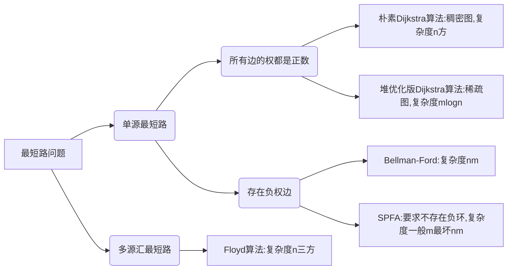

# 时间复杂度

一般评测机一秒最多可以运行 一亿次 即 $10^8$ 次。而一般的时间限制为 1s。在这种情况下，代码的操作次数控制在$10^7 - 10^8$为最佳。

|    数据范围     |               时间复杂度                | 可选择的算法                                                 |
| :-------------: | :-------------------------------------: | :----------------------------------------------------------- |
|    $n ≤ 30$     |                指数级别                 | 爆搜、dfs + 剪枝、状态压缩 dp                                |
|    $n ≤ 100$    |                $O(n^3)$                 | floyd、dp                                                    |
|   $n ≤ 1000$    |          $O(n^2), O(n^2logn)$           | dp、二分、朴素版 Dijkstra、朴素版 Prim、Bellman-Ford         |
|   $n ≤ 10000$   |             $O(n\sqrt{n})$              | 块状链表、分块、莫队（很少见）                               |
|  $n ≤ 10^{5}$   |               $O(nlogn)$                | 各种 sort、set / map、heap、拓扑排序、dijkstra + heap、prim + heap、spfa、二分、求凸包、求半平面交、线段树、树状数组 |
|   $n≤10^{6}$    | $O(n) , 以及常数较小的\\ O(nlogn) 算法$ | hash、双指针、并查集，kmp、AC自动机；<br />sort、heap、dijkstra、spfa、树状数组 |
|    $n≤10^7$     |                 $O(n)$                  | 双指针、kmp、线性筛素数、AC 自动机                           |
|   $n ≤ 10^9$    |              $O(\sqrt{n})$              | 判断质数                                                     |
|   $n≤10^{18}$   |                $O(logn)$                | 最大公约数（欧几里得算法）、快速幂                           |
|  $n≤10^{1000}$  |             ${O((logn)}^2)$             | 高精度加减乘除                                               |
| $n≤10^{100000}$ |            $O(logn*loglogn)$            | 高精度加减、FFT / NTT                                        |


# 基础算法

## 排序

### 快速排序

1. **确定分界点x**：取左边界 q[l]，或者取中间值 q[(l+r)/2]，或者取右边界 q[r]，也可以随机；
2. **调整区间**(较难部分)：让小于等于 x 的数在一个区间，大于 x 的在另一个区间
3. **递归处理左右两端**

**平均时间复杂度**： O(nlogn)，每层期望是 n/2 ，递归深度 logn
使用双指针，从数组两端向中间靠拢。指针 i 从左端找大于等于 x 的数，指针 j 从右端找小于等于 x 的数，然后 swap 二者，直至 i 和 j 相遇。

```java
void quickSort(int l, int r) {
    // 递归终止条件，如果左边界下标大于等于右边界下标则认为递归结束
    if (l >= r) return;
    
    // 基准值一定要设定为一个具体的数，而不是一个位置，否则交换时基准可能改变
    int p = arr[l + r >> 1];
    
    // 左右提前预留一个位置
    int i = l - 1;
    int j = r + 1;
    while (i < j) {
        while (arr[++i] < p);
        while (arr[--j] > p);
        
        // 交换左右两侧不符合预期的数值
        if (i < j) swap(arr[i], arr[j]);
    }
    // 由于分界值取的是left + right >> 1，因此递归取的是left，j j + 1，right
    quickSort(l, j);
    quickSort(j + 1, r);
}
```

### 归并排序

**基本思想**

1. **确定分界点** mid = ( l + r ) / 2，划分 left、right
2. **递归排序** left，right。
3. **归并**——合二为一。（较难步骤）

**时间复杂度**： O(nlogn)

**快排是不稳定的，归并是稳定的。**

```java
void mergeSort(int l, int r) {
    if (l >= r) return;
    
    int m = l + r >> 1;
    mergeSort(l, m);
    mergeSort(m + 1, r);
    
    int[] temp = new int[r - l + 1];
    int i = l, j = m + 1;
    int k = 0;
    
    // 归并
    while (i <= m && j <= r) {
        // 如果是逆序则调整if条件
        if (arr[i] <= arr[j]) temp[k++] = arr[i++];
        else temp[k++] = arr[j++];
    }
    // 收尾
    while (i <= m) temp[k++] = arr[i++];
    while (j <= r) temp[k++] = arr[j++];

    for (i = l, j = 0; i <= r; i++, j++)
        arr[i] = temp[j];
}
```

## 二分查找——找边界

有单调性一定可以二分，但是可以二分的题目不一定非要有单调性。
核心：找到一个边界将区间划分为两部分，使得一部分满足 check，另一部分不满足。

### 整数二分

都是左闭右闭

```java
// 称之为左二分查询，查找左侧第一个满足条件的数
int lbs(int left, int right) {  
   while (left < right) {  
      int mid = left + right >> 1;  
      if (check(arr[mid])) right = mid;
      else left = mid + 1;  
   }  
   return left;	// = right
}

// 称之为右二分查询，查找右侧最后一个满足条件的数
int rbs(int left, int right) {  
   while (left < right) {
      int mid = left + right + 1 >> 1; // 向下取整，所以要加一，避免死循环 
      if (check(arr[mid])) left = mid;
      else right = mid - 1;
   }  
   return right; // = left
}
```

### 浮点数二分

double 可以直接除而不会取整，所以不用在意边界问题，较为简单。
判断条件一般为 r - l >= 1e-6.
次数一般取要求的保留小数点位数+2，例如保留5位小数，就是1e-7.

也可以不用 while，直接 for 循环100次，相当于区间除以 2 的100次方，得到的位数足够。

```java
double EPS = 1e-6;

double fbs(double left, double right) {  
   while (right - left > EPS) {  
      double mid = (left + right) / 2;  
      if (check(mid)) right = mid;  
      else left = mid;
   }  
   return left;  
}
```

## 高精度（C++ 需要，Java 和 Python 不关注）

对于一个大整数，通常用数组来存，通常**从低位开始存**较好。
原因是：因为整数相加要进位，当最高位要进位的时候，在数组的末尾使用 push_back() 加一位即可，较方便。反之，在头部加一位要将整个数组后移，较麻烦。

- 高精度加法
- 高精度减法
- 高精度乘低精度
- 高精度除以低精度


## 前缀和与差分

### 一维前缀和

S 下标从 1 开始，定义 S[0] = 0，是为了同一计算

```java
S[i] = a[1] + a[2] + ... a[i]
a[l] + ... + a[r] = S[r] - S[l - 1]
```

### 二维前缀和

同样从 1 开始

```java
S[i, j] = 第i行j列格子左上部分所有元素的和
以(x1, y1)为左上角，(x2, y2)为右下角的子矩阵的和为：
S[x2, y2] - S[x1 - 1, y2] - S[x2, y1 - 1] + S[x1 - 1, y1 - 1]
```

### 一维差分

差分是前缀和的逆运算，即根据给出的前缀和求原数组的值，这里根据 A[ ] 数组，构造 B[ ] 数组，使得 A 是 B 的前缀和。

差分有什么作用？
如果需要将数组 A[ ] 的 [ l , r ] 区间内所有数都 + c，操作 A 数组时，需要遍历一遍，时间复杂度为 O(n)。而操作 B 数组时，只需要将 $b_l + c$ ，就可以使的从 a[ l ] 到 a[ n ]的所有数都加 c，再使用 $b_{r+1} - c$，消除对 a[ r ]之后数的影响，就可以将时间复杂度降至 O(1)。

```java
给区间 A[l, r]中的每个数加上 c：B[l] += c, B[r + 1] -= c
差分构造：B[i] = A[i] - A[i - 1];  
更精简的，可以想象A初始为0，然后依次插入A[i,j]的元素，就可以统一理解了
```

### 二维差分

```java
给以(x1, y1)为左上角，(x2, y2)为右下角的子矩阵中的所有元素加上 c：
S[x1, y1] += c, S[x2 + 1, y1] -= c, S[x1, y2 + 1] -= c, S[x2 + 1, y2 + 1] += c
```

## 双指针算法

对于以往需要双重 for 循环暴力解的题目进行优化；在快排和归并排序中都用到了双指针的思想。

所以一般做题都是先用暴力解法想思路，再用双指针优化时间复杂度。

```java
for (int i = 0, j = 0; i < n; i ++ ) {
    while (j < i && check(i, j)) j ++ ;
    // 具体问题的逻辑
}
常见问题分类：
    (1) 对于一个序列，用两个指针维护一段区间
    (2) 对于两个序列，维护某种次序，比如归并排序中合并两个有序序列的操作
```

## 位运算

```java
1.求 n 的二进制第 k 位数字: n >> k & 1
2.返回 n 的二进制最后一位 1：lowbit(n) = n & -n = n & (~n + 1)
因为反码 -n 是 n 的负数，即为 n 的补码加 1 ：-n = ~n + 1
```

## 离散化——处理稀疏问题

这里指整数的离散化，且是保序的离散化：将数组 a[ ] 中的数映射到 0 1 2 3 4 … 这样连续的自然数

```
1. a[] 中可能存在重复元素：去重
2. 排序
3. 如何算出某一个数 x 离散化后的映射值 ：二分
```

## 区间合并

1. 按区间左端点排序
2. 把有交集的区间合并——维护一个当前的区间


# 数据结构

## 链表与邻接表

### 链表

使用结构体加指针的方式实现链表非常慢，所以笔试题一般不用，主要面试用，这里使用数组模拟链表的方式。

#### 数组模拟单链表

单链表在算法题、笔试里用的最多的是邻接表，邻接表最常见的应用就是：**存储图和树**。

```java
// head存储头指针，e[]存储节点的值，ne[]存储节点的next指针，idx表示当前用到了哪个节点
int head, e[N], ne[N], idx;

// 初始化
void init() {
    // 下标0不存东西
    head = 0;
    idx = 1;
}

// 在链表头插入一个数x
void addHead(int x) {
    // 先记录 idx 的值
    // 然后让 idx 指向头指针指向的结点
    // 修改s指针的指向为 idx
    // idx 加 1
    e[idx] = x;
    ne[idx] = head;
    head = idx ++;
}
// 将x插入到下标k节点后面s
void add(int k, int x) {
    e[idx] = x;
    ne[idx] = ne[k];
    ne[k] = idx ++;
}

//将下标k后面的点删掉
void remove(int k){
    // 第 k 个结点指向 next 的 next
    else ne[k] = ne[ne[k]];
}
```

#### 数组模拟双链表

双链表主要是用来优化某些问题

```java
// e[]表示节点的值，l[]表示节点的左指针，r[]表示节点的右指针，idx表示当前用到了哪个节点
// 不设置 head 和 tail ，设置 0 和 1 为 head 和 tail
int e[N], l[N], r[N], idx;

// 初始化
void init() {
    //head是左端点，tail是右端点，最后都会插在两者之间
    int head = 0, tail = N - 1;
    r[head] = tail, l[tail] = head;
    idx = 1;
}

// 在节点k的右边插入一个数x
void insert(int k, int x) {
    e[idx] = x;
    l[idx] = k, r[idx] = r[k];
    l[r[k]] = idx, r[k] = idx ++ ;
}

// 在k的右边插入x
insert(l[k], x)

// 删除节点k
void remove(int k) {
    l[r[k]] = l[k];
    r[l[k]] = r[k];
}

```

## 栈与队列

### 栈

#### 普通栈

```java
// tt表示栈顶
int stk[N], tt = 0;

// 向栈顶插入一个数
stk[ ++ tt] = x;

// 从栈顶弹出一个数
tt -- ;

// 栈顶的值
stk[tt];

// 判断栈是否为空
if (tt > 0)
```

#### 单调栈

**常用题型**：在序列中每一个数的左/右边离他最近的比它小/大的数字在什么地方。

```java
int tt = 0;
for (int i = 1; i <= n; i ++ ) {
    while (tt && check(stk[tt], i)) tt -- ;
    stk[ ++ tt] = i;
}
```

### 队列

#### 普通队列

```java
// hh 表示队头，tt表示队尾
int q[N], hh = 0, tt = -1;

// 向队尾插入一个数
q[ ++ tt] = x;

// 从队头弹出一个数
hh ++ ;

// 队头的值
q[hh];

// 判断队列是否为空
if (hh > tt)
```

#### 单调队列

常见模型：找出滑动窗口中的最大值/最小值

在队列中只保留那些可能成为窗口最大元素的数字，如果队列中进来一个较大的数字，那么队列中比这个数更小的数字就不可能再成为窗口中最大的元素了

```java
int hh = 0, tt = -1;
// 数组 q 保存滑动窗口处理后的严格单调队列元素的下标
int[] q;
for (int i = 0; i < n; i ++ ) {
    // 判断队头是否需要滑出窗口
    // 队列不空且满足弹出条件
    if (hh <= tt && check_out(q[hh])) hh ++ ; 
    // 判断队尾元素是否需要弹出
    while (hh <= tt && check(q[tt], i)) tt -- ;
    q[ ++ tt] = i;
}
```

## KMP

```java
// s[n]是长文本，p[m]是模式串
// 求模式串的Next数组，从1开始：
for (int i = 2, j = 0; i <= m; i ++ ) {
    while (j && p[i] != p[j + 1]) j = ne[j];
    if (p[i] == p[j + 1]) j ++ ;
    ne[i] = j;
}

// 匹配
for (int i = 1, j = 0; i <= n; i ++ ) {
    while (j && s[i] != p[j + 1]) j = ne[j];
    if (s[i] == p[j + 1]) j ++ ;
    if (j == m) {
        // 再次匹配
        j = ne[j];
        // 匹配成功后的逻辑
    }
}
```

## Tire 字典树

Tire 树：高效存储和查找字符串集合的数据结构

```java
int son[N][26], cnt[N], idx;
// 0号点既是根节点，又是空节点
// son[][]存储树中每个节点的子节点，相当于链表中的ne[]
// cnt[]存储以每个节点结尾的单词数量
// idx 可以理解为不同的结点

void insert(String s) {  
   // 指针，从根节点到尾节点，跟随o的遍历而变化
   int p = 0;  
   for (int i = 0; i < s.length(); i++) {  
      // u是字符的int值  
      int u = s.charAt(i) - 'a';  
      // 如果匹配不到，则创建该节点
      if (son[p][u] == 0) son[p][u] = ++idx;  
      // 更新结点
      p = son[p][u];  
   }  
   cnt[p]++;  
}

int query(String s) {  
   int p = 0;  
   for (int i = 0; i < s.length(); i++) {  
      int u = s.charAt(i) - 'a';  
      if (son[p][u] == 0) return 0;
      p = son[p][u];  
   }
   return cnt[p];  
}
```

## 并查集

并查集可以在近乎 O(1) 的时间内完成以下两个操作

1. 将两个集合合并
2. 查询两个元素是否在一个集合当中

**基本原理**：每个集合用一棵树来表示，树根的编号就是整个集合的编号，每个节点存储它的父节点，p[x] 表示 x 的父节点。

- 问题一：如何判断树根：if(p[x] == x)，除了根节点之外，p[x] 都不等于 x；
- 问题二：如何求 x 的集合编号（树根）：while(p[x] != x) x = p[x]；
- 问题三：如何合并两个集合：p[x] 是 x 的集合编号，p[y] 是 y 的集合编号，p[x] = y。
- 优化：
	- 路径压缩：一个节点找到根节点，就把路径上经过的所有节点都指向根节点；
	- 按质合并：一般很少用。

```java
// 朴素并查集：

    int p[N]; //存储每个点的祖宗节点
    // 返回x的祖宗节点
    int find(int x) {
        if (p[x] != x) p[x] = find(p[x]);
        return p[x];
    }
    // 初始化，假定节点编号是1~n
    for (int i = 1; i <= n; i ++ ) p[i] = i;
    // 合并a和b所在的两个集合：
    p[find(a)] = find(b);

// 维护size的并查集：

    //size[]只有祖宗节点的有意义，表示祖宗节点所在集合中的点的数量
    int p[N], size[N];

    int find(int x) {
        if (p[x] != x) p[x] = find(p[x]);
        return p[x];
    }
    
    for (int i = 1; i <= n; i ++ ) {
        p[i] = i;
        size[i] = 1;
    }
    // 合并a和b所在的两个集合，下面两句一定不能颠倒：
    size[find(b)] += size[find(a)];
    p[find(a)] = find(b);

// 维护到祖宗节点距离的并查集：
    
    // d[x]存储x到p[x]的距离
    int p[N], d[N];

    // 返回x的祖宗节点
    int find(int x){
        if (p[x] != x){
            int u = find(p[x]);
            d[x] += d[p[x]];
            p[x] = u;
        }
        return p[x];
    }

    for (int i = 1; i <= n; i ++ ){
        p[i] = i;
        d[i] = 0;
    }
    // 合并a和b所在的两个集合：
    p[find(a)] = find(b);
    d[find(a)] = distance; // 根据具体问题，初始化find(a)的偏移量
```

## 堆

堆的**存储**（完全二叉树）：
按照小根堆（最小堆）来存储；使用一维数组存储，下标从 1 开始，若父节点为 x ，则左儿子为 2x，右儿子为 2x+1。

**两个基本操作**：
down(x)：将一个节点向下移；实现逻辑：与较小的儿子交换
up(x)：将一个节点向上移；实现逻辑：与父节点比较，若小于父节点则交换

在将一个**数组建堆**的时候，若一个个插入堆，时间复杂度为 O(nlogn)，而使用 for (int i= n /2; i; i-- ) down(i)；可实现 O(n) 建堆，因为最下面一排叶节点不用参与。

```java
// h[N]存储堆中的值, h[1]是堆顶，x的左儿子是2x, 右儿子是2x + 1
// ph[k]存储第 k 个插入的点在堆中的位置
// hp[m]存储堆中下标是 m 的点是第几个插入的
int h[N], ph[N], hp[N], size;

// 交换两个点，及其映射关系，一般的堆不需要维护复杂的映射关系
void heap_swap(int a, int b) {
    swap(ph[hp[a]],ph[hp[b]]);
    swap(hp[a], hp[b]);
    swap(h[a], h[b]);
}
// 进行down操作时必须满足左儿子和右儿子已经是堆
void down(int u) {
    // 三个点中的最小值
    int t = u;
    // 如果左子节点合法，并且左子节点小于当前节点，则需要调整堆
    if (u * 2 <= size && h[u * 2] < h[t]) t = u * 2;
    // 同理
    if (u * 2 + 1 <= size && h[u * 2 + 1] < h[t]) t = u * 2 + 1;
    // 如果需要调整
    if (u != t) {
        heap_swap(u, t);
        // 递归
        down(t);
    }
}

void up(int u) {
    // 父节点合法，并且父节点大于当前节点
    while (u / 2 > 0 && h[u] < h[u / 2]) {
        heap_swap(u, u / 2);
        u >>= 1;
    }
}

// O(n)建堆
for (int i = n / 2; i > 0; i -- ) down(i);
```

实现五个基本使用操作：

1. 插入一个数：`heap[++size] = x; up(size);`
2. 求集合当中的最小值：`heap[1];`
3. 删除最小值：`heap[1] = heap[size]; size--; down(1);`（最后一个元素覆盖堆顶元素）
4. 删除任意一个元素：`heap[k] = heap[size]; size--; down(k); up(k);`（同理）
5. 修改任意一个元素：`heap[k] = x; down(k); up(k);`

除了 2 是 $O(1)$ 的，其他是 $O(logn)$ 的。

## 哈希表

### 一般哈希

将一个很大的值域映射到 0~N 的空间上，一般 N 为 $10^5$ 或 $10^6$。
一般映射是使用取模的方法，且 mod 的数一般取质数，该质数一般离 2 的整次幂尽可能的远，因为这样取的话，冲突的可能性最小。
这里取 x mod 大于 $10^5$ 的质数，第一个为 100003，主要区别在于映射时的冲突如何处理。
一般只有添加和查找两个操作，很少会有删除的操作。

**存储结构**

**1. 拉链法**
开一个一维数组存储所有的值，数组中的每一位存储 e[ ] 和 ne[ ]，因为把每一位看作一个槽，里面放一个链表，理想的情况下每个槽只有一个数，冲突的时候会需要链表。
**添加**和**查找**：h(x)

**2. 开放寻址法**
只开了一个一维数组没有开链表，一般长度为题目数据范围的 2 ~ 3 倍（经验范围，这样发生冲突的可能性较低）。
处理冲突：h(x) = k，若该位置已有数值，则后移一位，直至移至一个空位存储。

**添加**：h(x) = k，有数就后移，没数就存储，若有相同数则无需操作。
**查找**：h(x) = k，当前位有数判断是否为 x ，不是就后移，直至找到或者遇到空位，遇到空位说明不存在 x 

```java
// 拉链法
int h[N], e[N], ne[N], idx;

// 向哈希表中插入一个数
void insert(int x) {
    // 由于负数求模也是负数，因此加上N
    int k = (x % N + N) % N;
    // 头插法
    e[idx] = x;
    ne[idx] = h[k];		// h[k]理解为头指针
    h[k] = idx++;
}
// 在哈希表中查询某个数是否存在
boolean find(int x) {
    int k = (x % N + N) % N;
    for (int i = h[k]; i != 0; i = ne[i])
        if (e[i] == x) return true;
    return false;
}

// 开放寻址法
int h[N];
Arrays.fill(h, INF);	// 表示此位置没有被用
// 如果x在哈希表中，返回x的下标；如果x不在哈希表中，返回x应该插入的位置
int find(int x) {
    int t = (x % N + N) % N;
    while (h[t] != INF && h[t] != x) {
        t ++ ;
        // 循环，最后一个坑位看完了看第一个
        if (t == N) t = 0;
    }
    return t;
}
```

### 字符串前缀哈希

简单说就是把一个字符串映射成一个数字
具体点，就是把一个字符串如 ”ABC” 映射成一个 p 进制的数字
$ABC –> p^2*A + p^1*B + p^0*C$ = 哈希值

**求哈希值的方法：**

1. 将字符串看作是一个 P 进制的数
2. 将该 P 进制的数改为 10 进制数
3. 模 Q 来将该数字映射到 0 ~ Q - 1 的区间

**注意：**

1. 一般**不能映射成 0** 。（原因：可能会将不同的字符串映射为相同的值。如，若 A 为 0 ，映射后为 0 ；AA 也为 0 ，映射后同样是 0）
2. 一般取 **P = 131 或 13331** ，**Q = $2^{64}$**，基本不会出现冲突。

```java
// h[k]存储字符串前k个字母的哈希值, p[k]存储 P^k mod Q，java中long有溢出操作，溢出的结果就是取模的结果
long[] h[N], p[N]; 
char[] sc;		// 字符化
// 初始化
p[0] = 1;
for (int i = 1; i <= n; i ++ ) {
    h[i] = h[i - 1] * P + sc[i];
    p[i] = p[i - 1] * P;
}
// 计算子串 sc[l ~ r] 的哈希值
long get(int l, int r) {
    // 因为取模运算对加减乘都是同态的，所以用取模后的结果来计算，再取模得到的结果也一定是正确的
    return h[r] - h[l - 1] * p[r - l + 1];
}
```


# 搜索与图论

## 树与图的存储

存储方式两种：

邻接矩阵（用的较少） 不能保存重边，空间复杂度为 $n^2$，较适合存储稠密图。
邻接表（用的多） 在数组的每个节点上都有一个单链表。每次插入一个链接时，在单链表头部插入（头插法）

```java
// 对于每个点k，开一个单链表，存储k所有邻接点；h[k]存储这个单链表的头指针（类似拉链表）
int h[N], e[N], ne[N], idx;

// 添加一条边a->b，没有顺序
void add(int a, int b) {
    e[idx] = b;
    ne[idx] = h[a];
    h[a] = idx++;
}
```

## 树与图的搜索

DFS 优先深度，到不能再前进的时候（叶子节点）再回溯；BFS 一层层搜索，搜索完每一代节点后，再搜索下一代节点。

|          |       DFS       |   BFS    |
| :------: | :-------------: | :------: |
| 数据结构 |      stack      |  queue   |
|   空间   | O(h)（h为深度） | $O(2^h)$ |

DFS 在空间使用上有优势，但不具有**最短路**性。
BFS 有一个**最短路**的概念，即假设树中每条边的权重均为1， BFS 搜索到某一个点的路径，一定是最短距离。

最小步数、最短距离，最少操作等：BFS
算法思路较奇怪或者空间要求较高：DFS

### DFS

最重要的考虑点在于：**顺序**，决定要以什么样的顺序来遍历所有方案；时间复杂度 O(n+m)
回溯时不要忘了**恢复现场**，即回溯前是什么样，回溯后还应时什么样。

```java
void dfs(int u) {
    state[u] = true;
    if(到达终点状态) return; 
    for (int i = h[u]; i != 0; i = ne[i]) {	// 遍历可扩展的路径
        int j = e[i];	// 扩展节点
        if (!state[j] && check()) {	// 扩展节点是否合法，剪枝
            修改现场;
            dfs(j);
            还原现场;	// 看是否需要
        }
    }
}
```

### BFS

```java
Queue<Integer> q;
state[1] = true;	// 表示1号点已经被遍历过
q.add(1);

while (!q.isEmpty()){
    int t = q.poll();

    for (int i = h[t]; i != 0; i = ne[i]) {	// 队头（当前节点）可扩展路径
        int j = e[i];	// 扩展节点
        if (check() && !state[j]) {		// 是否能走以及是否走过
            state[j] = true;
            q.add(j);
        }
    }
}
```

#### 拓扑排序

针对有向图，无向图没有拓扑序列。**定义**：若一个由图中所有点构成的序列 A 满足：对于图中的每条边 (x, y)，x 在 A 中都出现在 y 之前，则称 A 是该图的一个**拓扑序列**。

时间复杂度 $O(n+m)$

```java
boolean topsort() {
    int hh = 0, tt = -1;

    // d[i] 存储点i的入度
    for (int i = 1; i <= n; i ++ )
        // 初始化，入度为0的入队列
        if (d[i] == 0) q[++tt] = i;

    while (hh <= tt) {
        int t = q[hh++];
        for (int i = h[t]; i != 0; i = ne[i]) {
            int j = e[i];
            if (--d[j] == 0) q[++tt] = j;
        }
    }
    // 如果所有点都入队了，说明存在拓扑序列；否则不存在拓扑序列。
    return tt == n - 1;
}
```

### 回溯法中的重复问题

```java
// 原数组可以排序
boolean[] st;	// 全局
if (i > 0 && !st[i - 1] && nums[i] == nums[i - 1]) {
    continue;
}

// 组合问题可以用
void dfs(int idx) {
    for (int i = idx; i < n; i++){
        if (i > idx && nums[i] == nums[i - 1]) {
            continue;
        }
        ...
    }
}

// 原数组不可以排序的
void dfs(int idx){
    boolean[] st = new boolean[25];	// 每一层刷新
    for (int i = idx; i < n; i++){
        if (i > 0 && nums[i] == nums[i - 1] && st[nums[i - 1]]){ // 相当于哈希
            continue;
        }
        ...
    }
}
```

## 最短路

最短路问题分为单源最短路和多源汇最短路，考察的侧重点在于从背景抽象建图，不在于算法的证明。

**一般用 SPFA 算法**



### 朴素 dijkstra

时间复杂度 $O(n^2+m)$

```java
初始化 dist[1] = 0, dist[i] = 正无穷
for n 次
    for 遍历每一个点
        找到未处理的距离起点的最小值 t
	用 t 更新所有 dist[i]
```

```java
int g[N][N];  // 邻接矩阵
int dist[N];  // 存储起始点到每个点的最短距离
boolean st[N];   // 存储每个点的最短路是否已经确定

int dijkstra() {
    Arrays.fill(dist, INF);
    dist[1] = 0;
    // 每次必然可以确定一个点的最短距离
    for (int i = 0; i < n; i ++ ) {
        int t = -1;     // 初始点
        // 在还未确定最短路的点中，寻找dist最小的点
        for (int j = 1; j <= n; j ++ )
            if (!st[j] && (t == -1 || dist[t] > dist[j]))
                t = j;

        // 用t更新其他点的距离
        for (int j = 1; j <= n; j ++ )
            dist[j] = min(dist[j], dist[t] + g[t][j]);

        st[t] = true;
    }
    if (dist[n] == INF) return -1;
    return dist[n];
}
```

### 堆优化 dijkstra

时间复杂度 $O(mlogn)$

```java
int h[N], w[N], e[N], ne[N], idx;       // 邻接表
int dist[N];        
boolean st[N];

int dijkstra() {
    Arrays.fill(dist, INF);
    dist[1] = 0;
    PriorityQueue<int[]> heap;		// [节点编号,距离]
    heap.offer(new int[]{0, 1});

    while (!heap.isEmpty()) {
        int[] a = heap.poll();
        int t = a[0], distance = a[1];

        if (st[t]) continue;
        st[t] = true;
		
        for (int i = h[t]; i != 0; i = ne[i]) {
            int j = e[i];
            if (dist[j] > distance + w[i]) {
                dist[j] = distance + w[i];
                heap.offer(new int[]{j, dist[j]});
            }
        }
    }
    if (dist[n] == INF) return -1;
    return dist[n];
}
```

时间复杂度 $O(mn)$

### Bellman-Ford 算法——有边数限制的最短路

```java
for n 次		// 迭代k次的意义是经不超过k条边到每个点的最短距离
    		//所以如果第n次迭代仍然会更新，就说明存在一条长度是n+1的最短路径，说明图中存在负权回路
    for 所有边 a,b,w	// 边，a表示出点，b表示入点，w表示权重
        dist[b] = min(dist[b], dist[a] + w)	// 对于有边数限制的问题需要用dist的备份数组back[a]
```

```java
int n, m;       // n表示点数，m表示边数
int dist[N];        // dist[x]存储1到x的最短路距离

class Edge {
    int a, b, w;
    public Edge(int a, int b, int w) {
        this.a = a; this.b = b; this.w = w;
    }
}
edges[Edge];

int bellman_ford() {
    Arrays.fill(dist, INF);
    dist[1] = 0;

    for (int i = 0; i < n; i ++ ) {
        for (int j = 0; j < m; j ++ ) {
            int a = edges[j].a, b = edges[j].b, w = edges[j].w;
            dist[b] = min(dist[a] + w, dist[b]);
        }
    }
    return dist[n];
}
if (dist[n] > INF / 2) sout("impossible");
```

### spfa 算法（队列优化的 Bellman-Ford 算法）

时间复杂度 平均情况下 $O(𝑚)$，最坏情况下 $O(𝑛𝑚)$ ，spfa 就是 bellman-ford 算法加上 bfs 优化

```java
dist[b] = min(dist[b], dist[a] + w) 可以发现只有 dist[a] 变小了，dist[b] 才会变小
q.offer(1);		// q中存dist变小的节点
while(q不空)
    t = q.pop();
    更新 t 的所有出边，把出边指向的顶点入队
```

```java
int spfa() {
    Arrays.fill(dist, INF);
    dist[1] = 0;

    Queue<int> q;
    q.offer(1);
    st[1] = true;

    while (!q.isEmpty()) {
        int t = q.poll();
        st[t] = false;

        for (int i = h[t]; i != 0; i = ne[i]) {
            int j = e[i];
            if (dist[j] > dist[t] + w[i]) {
                dist[j] = dist[t] + w[i];
                if (!st[j]) {    // 如果队列中已存在j，则不需要重复插入
                    q.offer(j);
                    st[j] = true;
                }
            }
        }
    }
    return dist[n];
}
```

#### spfa 判断图中是否存在负环

另外维护一个 cnt[x] 存储 1 到 x 的最短路中经过的边数，若 cnt[x] >= n，则存在负环

```java
// 不需要初始化dist数组
// 因为从1号点不一定能到达负环，所以一开始就把所有点扔进队列
Queue<int> q;
for (int i = 1; i <= n; i ++ ) {
    q.offer(i);
    st[i] = true;
}
```

### Floyd 算法

本质是动态规划，时间复杂度 $O(n^3)$

d[k, i, j] 表示 “**中间**（不包括端点）经过若干个编号不超过 k 的节点” 从 i 到 j 的最短距离。可以从两个状态得到：

1. 不经过 k ：d[k - 1, i, j]
2. 经过 k 从 i 到 j：d[k - 1, i, k] + d[k - 1, k, j]（d[k - 1, i, k] = d[k, i, k]，没有负环时，最短路不可能经过重复点）

之所以能降到二维，是因为在这个转移方程的约束下，第一个项读取的时候一定是上一层（k - 1）的值，后两项上一层和当前层的值是能够保证是一样的。

```java
int d[n][n]; 	// 邻接矩阵

// 算法结束后，d[a][b]表示a到b的最短距离
void floyd() {
    for (int k = 1; k <= n; k ++ )
        for (int i = 1; i <= n; i ++ )
            for (int j = 1; j <= n; j ++ )
                d[i][j] = min(d[i][j], d[i][k] + d[k][j]);
}
```

## 最小生成树

### Prim 算法

时间复杂度 $O(n^2+m)$，用于稠密图

最小生成树的边：t 对应集合的那条边

```java
dist[i] = INF;
for n 次
    找到集合外距离最近的点 t		 // 集合指当前已经在树中的点
    用 t 更新其他点到集合的距离		// 距离定义：点到集合中所有点的距离最小值。
    st[t] = true
```

```java
// 如果图不连通，则返回INF, 否则返回最小生成树的边权之和
int prim() {
    Arrays.fill(dist, INF);
    dist[1] = 0;

    int res = 0;
    // 每次可以加入一个点到树中
    for (int i = 0; i < n; i ++ ) {
        int t = -1;
        for (int j = 1; j <= n; j ++ )
            if (!st[j] && (t == -1 || dist[t] > dist[j]))
                t = j;

        if (dist[t] == INF) return INF;
        res += dist[t];
        st[t] = true;

        for (int j = 1; j <= n; j ++ ) 
            dist[j] = min(dist[j], g[t][j]);	// 注意此处和dijkstra的区别
    }
    return res;
}
```

### Kruskal 算法

时间复杂度$O(mlonm)$，用于稀疏图，用并查集做

```java
1. 将所有边按权重从小到大排序
2. 枚举每条边 ab，c
    if a,b 不连通
        连接ab
```

```java
class Edge {
    int a, b, w;
}

int find(int x) {
    if (p[x] != x) p[x] = find(p[x]);
    return p[x];
}

int kruskal() {
    sort(edges);

    for (int i = 1; i <= n; i ++ ) p[i] = i;    // 初始化并查集

    int res = 0, cnt = 0;	// cnt存当前树中的边数
    for (int i = 0; i < m; i ++ ) {
        int a = edges[i].a, b = edges[i].b, w = edges[i].w;

        a = find(a), b = find(b);
        if (a != b) {    // 如果两个连通块不连通，则将这两个连通块合并
            p[a] = b;
            res += w;
            cnt ++ ;
        }
        if (cnt == n - 1) return res;
    }
    return INF;
}
```

## 二分图

### 染色法判别

时间复杂度$O(n+m)$

**二分图性质：当且仅当图中不含奇数环。**

基于 DFS 染色，如果染色出现矛盾就不是二分图，否则就是二分图。

```java
int color[N];       // 表示每个点的颜色，-1表示未染色，0表示白色，1表示黑色

// u表示当前节点，c表示u的颜色
boolean dfs(int u, int c) {
    color[u] = c;
    for (int i = h[u]; i != 0; i = ne[i]) {
        int j = e[i];
        // 还未染色
        if (color[j] == -1) {
            // 邻接点染反色后出现矛盾
            if (!dfs(j, c^1)) return false;
        }
        // 已染色，判断是否矛盾
        else if (color[j] == c) return false;
    }
    return true;
}

boolean check() {
    Arrays.fill(color, -1);
    boolean flag = true;
    // 可能有不连通的情况，需要遍历
    for (int i = 1; i <= n; i ++ )
        // 如果没有染色，递归染色
        if (color[i] == -1)
            // 如果返回flase，说明染色出现矛盾
            if (!dfs(i, 0)) {
                flag = false;
                break;
            }
    return flag;
}
```

### 匈牙利算法——二分图的最大匹配

时间复杂度$O(nm)$

```java
int n1, n2;     // 男生人数和女生人数
int h[N], e[M], ne[M], idx;     // 邻接表存储所有边，匈牙利算法中只会用到从第一个集合指向第二个集合的边，所以这里只用存一个方向的边
int match[N];       // 存储女生当前匹配哪个男生
boolean st[N];     // 表示每个女生是否已经被遍历过

boolean find(int x) {
    // 尝试追各个心仪的对象
    for (int i = h[x]; i != 0; i = ne[i]) {
        int j = e[i];
        if (!st[j]) {	// 不追二次
            st[j] = true;
            // 妹子还没对象或者妹子的现男友可以换备胎
            if (match[j] == 0 || find(match[j])) {
                match[j] = x;	// 芜湖~在一起
                return true;
            }
        }
    }
    return false;
}

int res = 0;
for (int i = 1; i <= n1; i ++ ) {
    // 重置st（有对象的女生也可以被追）
    Arrays.fill(st, false);
    if (find(i)) res ++ ;
}
```


# 数学问题

## 数论

### 质数

#### 试除法判定质数

$O(sprt(n))$

```java
boolean is_prime(int x) {
    if (x < 2) return false;
    for (int i = 2; i <= x / i; i ++ )	// i*i<=n
        if (x % i == 0)
            return false;
    return true;
}
```

#### 试除法分解质因数

```java
void divide(int x) {
    for (int i = 2; i <= x / i; i++)
        if (x % i == 0) {	// i一定是质数
            int s = 0;	// i的次数
            while (x % i == 0) x /= i, s++;
        }
    // n 中最多只包含一个大于 sqrt(n) 的质因子
    // 特判：如果最后 x 大于 1，说明 x 中存在大于 sqrt(n) 的质因子
    if(x > 1) sout(x + " " + 1);
}
```

#### 朴素筛法求素数

每个数被质数筛掉，时间复杂度 O(nloglog(n))，近似为 O(n)

**质数定理： 1~n 中有 n/log(n) 个质数**

```java
int primes[N], cnt;     // primes[]存储所有素数
bool st[N];         // st[x]存储x是否被筛掉

void get_primes(int n) {
    for (int i = 2; i <= n; i ++ ) {
        if (!st[i]) {	// i是素数
            primes[cnt ++ ] = i;
            // i的倍数是合数，被筛掉
        	for (int j = i; j <= n; j += i)
            	st[j] = true;
        }
    }
}
```

#### [#](https://www.acwing.com/solution/content/100707/)线性筛法求素数

n 只会被**最小**质因子筛掉

```java
void get_primes(int n) {
    for (int i = 2; i <= n; i ++ ) {
        if (!st[i]) primes[cnt ++ ] = i;
        for (int j = 0; primes[j] <= n / i; j ++ ) {
            st[primes[j] * i] = true;	// 用最小质因子去筛合数
            if (i % primes[j] == 0) break;	// pj是i*pj的最小质因子，避免重复筛
        }
    }
}
```

### 约数

#### 试除法求约数

```java
void getDivisor(int x) {
    List<Integer> res;
    for(int i = 1; i <= x / i; i++) {
        if(x % i == 0) {
            res.add(i);
            // 成对出现
            if(i != x / i) res.add(a / i);
        }
    }
}
```

#### 约数个数 / 约数之和

```
N = p1^c1 * p2^c2 * ... *pk^ck
约数个数： (c1 + 1) * (c2 + 1) * ... * (ck + 1)
约数之和： (p1^0 + p1^1 + ... + p1^c1) * ... * (pk^0 + pk^1 + ... + pk^ck)
```

### 欧几里得算法

原理：$(a, b) = (b, a \% b)$

```java
int gcd(int a, int b) {
    return b > 0 ? gcd(b, a % b) : a;
}
```

#### 扩展欧几里得算法——裴属定理

```java
设ax1+by1=gcd(a,b), bx2+(a%b)y2=gcd(b,a%b);
由gcd(a,b)=gcd(b,a%b),可得:
ax1+by1=bx2+(a%b)y2;
即:ax1+by1=bx2+(a-(a/b)*b)y2
          =ay2+bx2-(a/b)*by2;
即:ax1+by1=ay2 + b(x2-(a/b)*y2)
根据恒等定理,对应项相等，得:x1=y2; y1=x2-(a/b)*y2;
这样我们就得到了:x1，y1的值基于x2，y2，所以我们可以通过递归求解。
```

```java
// 求x, y，使得ax + by = gcd(a, b)
void exgcd(int a, int b, int x, int y) {
    if (b == 0) {
        x = 1; y = 0;
        return;
    }
    exgcd(b, a % b);
    int t = x;
    x = y;
    y = t - a / b * y;
}
```

#### 中国剩余定理


### 欧拉函数

证明：容斥原理

```java
int phi(int x) {
    int res = x;
    for (int i = 2; i <= x / i; i ++ )
        if (x % i == 0) {
            res = res / i * (i - 1);
            while (x % i == 0) x /= i;
        }
    if (x > 1) res = res / x * (x - 1);

    return res;
}
```

#### 筛法求欧拉函数

```java
int primes[N], cnt;     // primes[]存储所有素数
int euler[N];           // 存储每个数的欧拉函数
bool st[N];         // st[x]存储x是否被筛掉
void get_eulers(int n) {
    euler[1] = 1;
    for (int i = 2; i <= n; i ++ ) {
        if (!st[i]) {
            primes[cnt ++ ] = i;
            // 如果一个数是质数的话，除了本身，其他所有数都和它互质，所以个数就是 i - 1
            euler[i] = i - 1;
        }
        for (int j = 0; primes[j] <= n / i; j ++ ) {
            int t = primes[j] * i;
            st[t] = true;
            if (i % primes[j] == 0) {
                // pj是i的质因子，说明i的公式里已经包含了这个因子的表达
                // 根据公式，只需要再乘以 pj
                euler[t] = euler[i] * primes[j];
                break;
            }
            // 如果 pj 不是 i 的质因子，根据公式如下
            euler[t] = euler[i] * (primes[j] - 1);
        }
    }
}
```

### 快速幂

可以快速求 $m^kmod p$，时间复杂度$O(logk)$

思路：预处理出  $m^{2^0},m^{2^1},m^{2^2},...,m^{2^logk}$，再将 k 表示为二进制

```java
int qmi(int m, int k, int p) {
    int res = 1;
    while (k != 0) {	// 对k进行二进制化,从低位到高位
        if (k & 1 == 1) res = res * m % p;	// 乘上当前幂次的结果
        m = m * m % p;	// 计算m^{2^0},m^{2^1},m^{2^2},...
        k >>= 1;
    }
    return res;
}
```

## 高斯消元

枚举每一列c：

- 找到当前列绝对值最大的一行
- 用初等行变换(2) 把这一行换到上面（未确定阶梯型的行，并不是第一行）
- 用初等行变换(1) 将该行的第一个数变成 1（其余所有的数字依次跟着变化）
- 用初等行变换(3) 将下面所有行的当且列的值变成 0

```java
int[] a[N][N]	// 增广矩阵
int gauss() {
    int c, r;	// c=column,r=row
    for (c = 0, r = 0; c < n; c ++ ) {	// 遍历每列
        int t = r;
        for (int i = r; i < n; i ++ )   // 找到绝对值最大的行
            if (abs(a[i][c]) > abs(a[t][c]))
                t = i;

        if (abs(a[t][c]) < eps) continue;	// 最大值为0

        for (int i = c; i <= n; i ++ ) swap(a[t][i], a[r][i]);    // 将绝对值最大的行换到顶端
        for (int i = n; i >= c; i -- ) a[r][i] /= a[r][c];      // 将当前行的首位变成1
        for (int i = r + 1; i < n; i ++ )       // 用当前行将下面所有的列消成0
            if (abs(a[i][c]) > eps)
                for (int j = n; j >= c; j -- )
                    a[i][j] -= a[r][j] * a[i][c];
        r ++ ;
    }
    if (r < n) {
        for (int i = r; i < n; i ++ )
            if (abs(a[i][n]) > eps)
                return 2; // 无解
        return 1; // 有无穷多组解
    }
    for (int i = n - 1; i >= 0; i -- )
        for (int j = i + 1; j < n; j ++ )
            a[i][n] -= a[i][j] * a[j][n];

    return 0; // 有唯一解
}
```

## 组合计数

### 递归法求组合数（预处理）

$O(n^2)$

```java
for (int i = 0; i < N; i ++ )
    for (int j = 0; j <= i; j ++ )
        if (j == 0) c[i][j] = 1;
        else c[i][j] = c[i - 1][j] + c[i - 1][j - 1];
```

$O(NlogN)$

```java
// 通过预处理逆元的方式求组合数
// 首先预处理出所有阶乘取模fact[N]，以及所有阶乘取模的逆元infact[N]，如果取模的数是质数，可以用费马小定理求逆元
int qmi(int a, int k, int p) {   // 快速幂模板
    ...
}

// 预处理阶乘的余数和阶乘逆元的余数
fact[0] = infact[0] = 1;
for (int i = 1; i < N; i ++ ) {
    fact[i] = fact[i - 1] * i % mod;
    infact[i] = infact[i - 1] * qmi(i, mod - 2, mod) % mod;
}

res = fact[a] * infact[a - b] * infact[b];
```

### Lucas 定理

若 p 是质数，则对于任意整数 $1 <= m <= n$，有：
$$
C_{a}^{b}≡C_{a\mod p}^{b\mod p}\cdot C_{a|p}^{b|p}(mod\,p)
$$

```java
int qmi(int a, int k) {      // 快速幂模板
    ...
}

long C(int a, int b) {    // 通过定理求组合数C(a, b)
    long res = 1;
    for (int i = 1, j = a; i <= b; i ++, j -- ) {
        res = res * j % p;
        res = res * qmi(i, p - 2) % p;
    }
    return long;
}

long lucas(LL a, LL b) {
    if (a < p) return C(a, b);
    return C(a % p, b % p) * lucas(a / p, b / p) % p;
}
```

### 分解质因数法求组合数

```java
当我们需要求出组合数的真实值，而非对某个数的余数时，分解质因数的方式比较好用：
    1. 筛法求出范围内的所有质数
    2. 通过 C(a, b) = a! / b! / (a - b)! 这个公式求出n!中每个质因子的次数。 n!中p的次数是 n / p + n / p^2 + n / p^3 + ...
    3. 用高精度乘法将所有质因子相乘
```

```java
int primes[N], cnt;     // 存储所有质数
int sum[N];     // 存储每个质数的次数
bool st[N];     // 存储每个数是否已被筛掉

void get_primes(int n) {     // 线性筛法求素数
    ...
}

int get(int n, int p) {      // 求n!的素因数p的次数
    int res = 0;
    while (n ！= 0) {
        res += n / p;
        n /= p;
    }
    return res;
}

get_primes(a);  // 预处理范围内的所有质数

for (int i = 0; i < cnt; i ++ ) {    // 求每个质因数的次数
    int p = primes[i];
    sum[i] = get(a, p) - get(b, p) - get(a - b, p);
}

BigInteger res = BigInteger.valueOf(1);

for (int i = 0; i < cnt; i ++ )     // 用高精度乘法将所有质因子相乘
    int p = primes[i];
    for (int j = 0; j < sum[i]; j ++ )
        res = res.multiply(BigInteger.valueOf(p));
```

### 卡特兰数

给定 n 个 0 和 n 个 1，它们按照某种顺序排成长度为 2n 的序列，满足任意前缀中 0 的个数都不少于 1 的个数的序列的数量为： $Cat(n) = C(2n, n) / (n + 1)$

### 容斥原理

技巧：用二进制表示集合被是否选中的状态


## 博弈论

### Nim 游戏

定理： Nim 博弈先手必胜，当且仅当 A1 ^ A2 ^ … ^ An != 0

### Mex 运算

设 S 表示一个非负整数集合。定义 mex(S) 为求出不属于集合 S 的最小非负整数的运算，即：
mex(S) = min{x}, x 属于自然数，且 x 不属于 S

### SG 函数

在有向图游戏中，对于每个节点 x，设从 x 出发共有 k 条有向边，分别到达节点 y1, y2, …, yk，定义 SG(x) 为 x 的后继节点 y1, y2, …, yk 的 SG 函数值构成的集合再执行 mex(S) 运算的结果，即：
SG(x) = mex({SG(y1), SG(y2), …, SG(yk)})
特别地，整个有向图游戏 G 的 SG 函数值被定义为有向图游戏起点 s 的 SG 函数值，即 SG(G) = SG(s)。

```java
int f[M],p[N];// p存可供选择的集合,f存sg值
int sg(int x){
    if(f[x] != -1)  return f[x]; // 记忆化搜索，如果f[x]已经被计算过，则直接返回
    							 // 因为可取数目的集合已经确定,所以每个数的sg值也是确定的
    Set<Integer> set = new HashSet<>();
    for(int i = 0; i < n ; i ++ ){ 
        if(x >= p[i]) set.add(sg(x - p[i]));  // 如果可以拿走p[i]个
    }
    // 求mex()
    for(int i = 0 ; ;i ++ ){
        if(!set.contains(i)){
            return f[x] = i;
        }
    }
}
```


# 动态规划


### 区间DP

所有的区间 dp 问题枚举时，第一维通常是枚举区间长度，并且一般 len = 1 时用来初始化，枚举从 len = 2 开始；第二维枚举起点 i （右端点 j 自动获得，j = i + len - 1）：

```java
for (int len = 1; len <= n; len++) {         // 区间长度
    for (int i = 1; i + len - 1 <= n; i++) { // 枚举起点
        int j = i + len - 1;                 // 区间终点
        if (len == 1) {
            dp[i][j] = 初始值
            continue;
        }

        for (int k = i; k < j; k++) {        // 枚举分割点，构造状态转移方程
            dp[i][j] = min(dp[i][j], dp[i][k] + dp[k + 1][j] + w[i][j]);
        }
    }
}
```

### 状态压缩DP

二进制表示状态

### 树形DP

DFS 搜索

### 记忆化搜索

递归

# 贪心

尽量推出数学公式